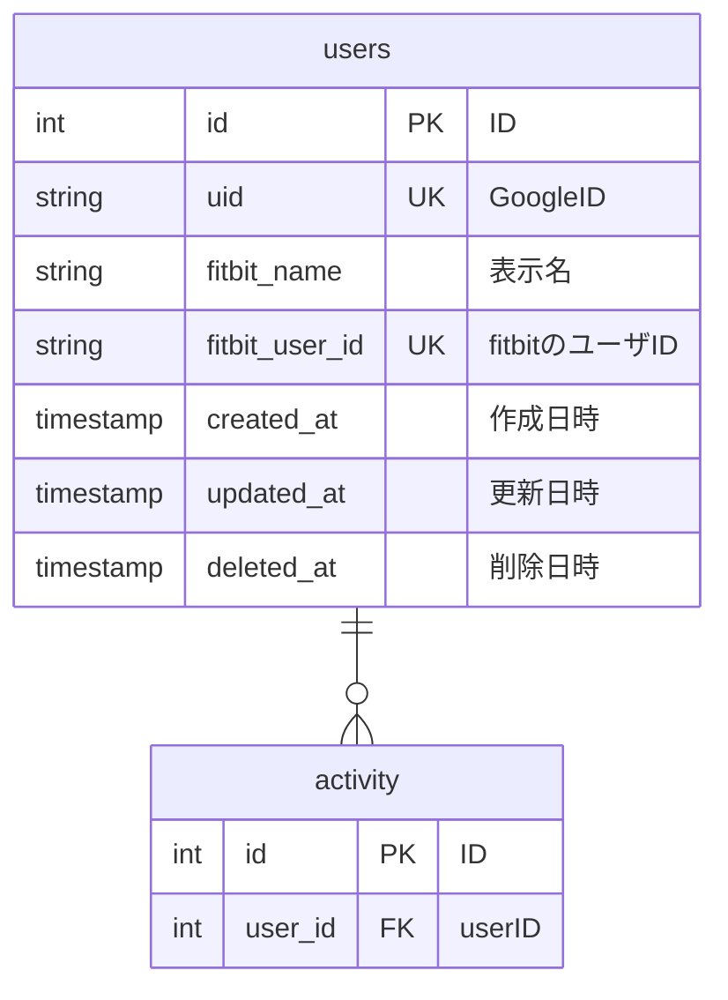

# ER 図

```mermaid

erDiagram
    users ||--o{ activity:""
    users {
        int id PK "ID"
        string uid UK "GoogleID"
        string fitbit_name "表示名"
        string fitbit_user_id UK "fitbitのユーザID"
        timestamp created_at "作成日時"
        timestamp updated_at "更新日時"
        timestamp deleted_at "削除日時"
    }

    activity{
        int id PK "ID"
        int user_id FK "userID"
    }

```
